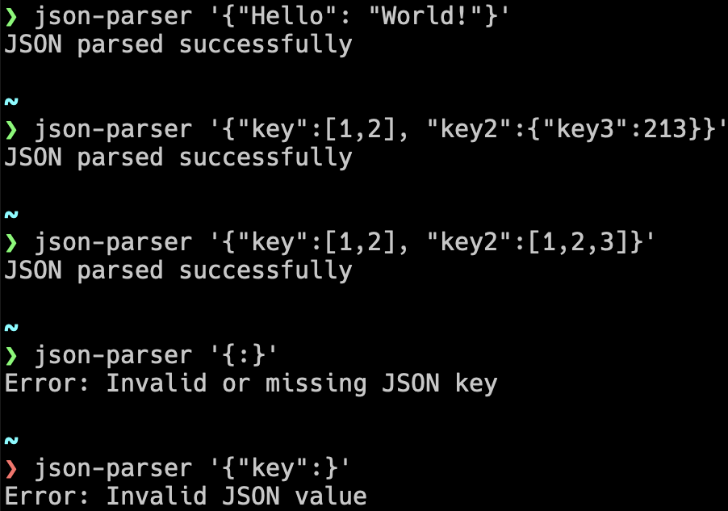

# JSON Parser
A simple JSON parser. It is inspired by coding [challenges](https://codingchallenges.fyi/challenges/challenge-json-parser).



## Features
- Validates if a string is a valid JSON.

## Install
```bash
go install github.com/ondrejmalina/json-parser@latest
```


